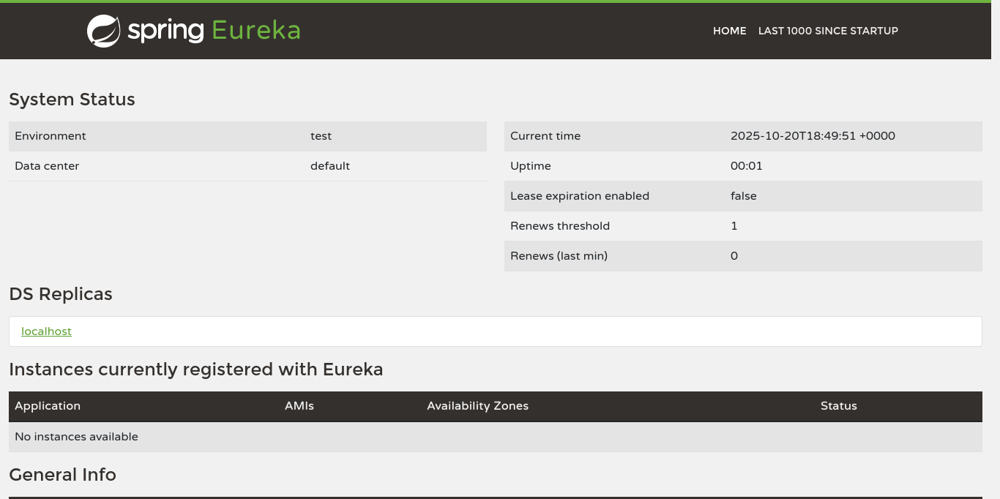

# Food Ordering App

This is a simple food ordering application built using Angular for the frontend and Spring Boot for the backend. The backend is structured as a set of microservices that follow the Netflix Microservices Architecture patterns and are integrated with Spring Cloud Netflix.

## Architecture

The application is composed of the following microservices:

*   **Eureka Server:** A service discovery server that allows the microservices to find each other.
*   **Config Server:** A centralized configuration server that provides configuration to all the microservices.
*   **API Gateway:** A single entry point for all frontend requests.
*   **User Service:** A microservice that handles user-related operations.
*   **Menu Service:** A microservice that handles the food menu.
*   **Order Service:** A microservice that handles food orders.
*   **Frontend:** An Angular application that provides the user interface.

### Architecture Diagram

```
+-----------------+      +-----------------+      +-----------------+
|                 |      |                 |      |                 |
|  Frontend       +----->+  API Gateway    +----->+  Eureka Server  |
| (Angular)       |      | (Spring Cloud)  |      | (Spring Cloud)  |
|                 |      |                 |      |                 |
+-----------------+      +-------+---------+      +-----------------+
                                 |
                                 |
           +---------------------+---------------------+
           |                     |                     |
+----------v----------+ +--------v---------+ +---------v---------+
|                     | |                  | |                   |
|   User Service      | |   Menu Service   | |   Order Service   |
| (Spring Boot)       | | (Spring Boot)    | | (Spring Boot)     |
|                     | |                  | |                   |
+---------------------+ +------------------+ +-------------------+
           ^                     ^                     ^
           |                     |                     |
           +---------------------+---------------------+
                                 |
                       +---------v---------+
                       |                   |
                       |   Config Server   |
                       | (Spring Cloud)    |
                       |                   |
                       +-------------------+
```

## Getting Started

### Prerequisites

*   Java 17+
*   Maven 3.2+
*   Node.js 18+
*   Angular CLI 17+
*   Docker and Docker Compose (for running with Docker)

### Running without Docker

1.  **Start Eureka Server:**
    ```bash
    cd backend/eureka-server
    mvn spring-boot:run
    ```

2.  **Start Config Server:**
    ```bash
    cd backend/config-server
    mvn spring-boot:run
    ```

3.  **Start API Gateway:**
    ```bash
    cd backend/api-gateway
    mvn spring-boot:run
    ```

4.  **Start User Service:**
    ```bash
    cd backend/user-service
    mvn spring-boot:run
    ```

5.  **Start Menu Service:**
    ```bash
    cd backend/menu-service
    mvn spring-boot:run
    ```

6.  **Start Order Service:**
    ```bash
    cd backend/order-service
    mvn spring-boot:run
    ```

7.  **Start Frontend:**
    ```bash
    cd frontend/food-ordering-app
    npm install
    ng serve
    ```

The application will be available at http://localhost:4200.

### Running with Docker

1.  **Build and start the application:**
    ```bash
    docker-compose up --build
    ```

The application will be available at http://localhost:4200.

## Sanity Test Results

The application is currently **not stable**. During pre-deployment testing, several critical issues were identified that prevent the application from running correctly.

### Eureka Dashboard

The Eureka dashboard shows that only the `api-gateway` and `config-server` are registered. The other services are failing to start and register.



### Docker Container Status

The `docker compose ps` command shows that all containers are running, but the services are not healthy.

```
<pre>

</pre>
```

### Service Logs

The logs for the failing services (`api-gateway`, `user-service`, `menu-service`, and `order-service`) all show a similar error:

```
<pre>

</pre>
```

The services are failing to start because they are not configured to connect to the config server.

## API Endpoints

### User Service

*   `GET /api/users`: Get all users
*   `GET /api/users/{id}`: Get a user by ID
*   `POST /api/users`: Create a new user

### Menu Service

*   `GET /api/menu`: Get all menu items
*   `GET /api/menu/{id}`: Get a menu item by ID
*   `POST /api/menu`: Create a new menu item
*   `DELETE /api/menu/{id}`: Delete a menu item by ID

### Order Service

*   `GET /api/orders`: Get all orders
*   `GET /api/orders/{id}`: Get an order by ID
*   `GET /api/orders/user/{userId}`: Get all orders for a user
*   `POST /api/orders`: Create a new order
